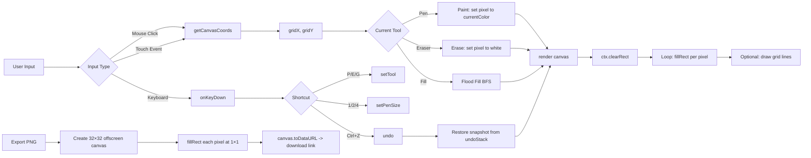

<div align="center">

  <picture>
    <source media="(prefers-color-scheme: dark)" srcset="data:image/svg+xml,%3Csvg xmlns='http://www.w3.org/2000/svg' viewBox='0 0 64 64'%3E%3Crect width='64' height='64' fill='%231a1a2e' rx='12'/%3E%3Crect x='8' y='8' width='10' height='10' fill='%23ff7a00' rx='2'/%3E%3Crect x='20' y='8' width='10' height='10' fill='%23ff7a00' rx='2'/%3E%3Crect x='32' y='8' width='10' height='10' fill='%23ff7a00' rx='2'/%3E%3Crect x='44' y='8' width='10' height='10' fill='%23ff7a00' rx='2'/%3E%3Crect x='8' y='20' width='10' height='10' fill='%23ff7a00' rx='2'/%3E%3Crect x='20' y='20' width='10' height='10' fill='%23ff9933' rx='2'/%3E%3Crect x='32' y='20' width='10' height='10' fill='%23ff9933' rx='2'/%3E%3Crect x='44' y='20' width='10' height='10' fill='%23ff7a00' rx='2'/%3E%3Crect x='8' y='32' width='10' height='10' fill='%23ff7a00' rx='2'/%3E%3Crect x='20' y='32' width='10' height='10' fill='%23ff9933' rx='2'/%3E%3Crect x='32' y='32' width='10' height='10' fill='%23ff9933' rx='2'/%3E%3Crect x='44' y='32' width='10' height='10' fill='%23ff7a00' rx='2'/%3E%3Crect x='8' y='44' width='10' height='10' fill='%23ff7a00' rx='2'/%3E%3Crect x='20' y='44' width='10' height='10' fill='%23ff7a00' rx='2'/%3E%3Crect x='32' y='44' width='10' height='10' fill='%23ff7a00' rx='2'/%3E%3Crect x='44' y='44' width='10' height='10' fill='%23ff7a00' rx='2'/%3E%3C/svg%3E">
    
  </picture>

  <h1>🎨 Pixel Art Editor</h1>

  <p>A polished, zero-dependency 32×32 pixel art editor — works in any browser, deployable on GitHub Pages.</p>

  <p>
    <a href="#"></a>
    <a href="#"></a>
    <a href="#"></a>
    <a href="#"></a>
  </p>

  <p>
    <strong><a href="https://YOUR_USERNAME.github.io/pixel-art">🌐 Live Demo</a></strong>
    ·
    <strong><a href="#features">Features</a></strong>
    ·
    <strong><a href="#usage">Usage</a></strong>
    ·
    <strong><a href="#development">Development</a></strong>
    ·
    <strong><a href="#license">License</a></strong>
  </p>

</div>

---

## ✨ Features

- **32×32 canvas** — the classic pixel art grid size
- **16-color palette** — black, white, red, orange, yellow, green, blue, purple, pink, brown, gray, cyan, magenta, dark green, navy, silver
- **Click to paint** — left-click draws with the selected color
- **Right-click to erase** — instantly sets pixels to white
- **Pen size toggle** — 1px, 2px, or 4px brushes
- **Fill bucket** — flood-fill algorithm (BFS) for coloring contiguous areas
- **Undo** — up to 20 levels of undo history (Ctrl+Z / ⌘+Z)
- **Clear canvas** — reset everything with one click
- **Export as PNG** — downloads a clean 32×32 PNG (no grid lines)
- **Grid lines toggle** — show or hide the pixel grid
- **Dark theme** — deep blue-purple background with orange accent
- **Responsive** — works on desktop and mobile (touch support)
- **Keyboard shortcuts** — `P` pen, `E` eraser, `G` fill, `1`/`2`/`4` pen size, `Ctrl+Z` undo
- **Zero dependencies** — single HTML file, no CDN, no build tools
- **GitHub Pages ready** — just push and publish

## 🚀 Usage

1. Open `index.html` in any modern browser.
2. Select a color from the palette.
3. Click on the canvas to paint.
4. Right-click (or use the eraser tool) to remove pixels.
5. Toggle tools: **Pen** ✏️, **Eraser** 🧹, **Fill** 🪣.
6. Adjust pen size with the **1px / 2px / 4px** buttons.
7. Hit **Undo** ↩️ to step back (up to 20 steps).
8. Export your masterpiece with **Export PNG** 📥.

### ⌨️ Keyboard Shortcuts

| Key | Action |
|-----|--------|
| `P` | Pen tool |
| `E` | Eraser tool |
| `G` | Fill bucket |
| `1` | Pen size 1px |
| `2` | Pen size 2px |
| `4` | Pen size 4px |
| `Ctrl+Z` / `⌘+Z` | Undo |

## 🧠 Architecture



## 📁 Project Structure

```
pixel-art/
├── index.html   ← Self-contained editor (HTML + CSS + JS)
├── README.md    ← This file
└── LICENSE      ← MIT
```

## 🛠️ Development

This is a single HTML file with everything inlined. No build step required.

```bash
# Clone the repository
git clone https://github.com/YOUR_USERNAME/pixel-art.git
cd pixel-art

# Open locally
open index.html
# or: xdg-open index.html
# or: python3 -m http.server 8000  # then visit http://localhost:8000
```

### Making changes

All the code lives in `index.html`:
- **CSS** — in the `<style>` block (dark theme, responsive layout)
- **JavaScript** — in the `<script>` block (drawing engine, flood fill, undo system, event handling)
- **HTML** — semantic layout with ARIA-friendly controls

## 🌐 Deployment to GitHub Pages

1. Push this repository to GitHub.
2. Go to **Settings > Pages**.
3. Select the `main` branch as the source.
4. Your editor will be live at `https://YOUR_USERNAME.github.io/pixel-art/`.

## 📄 License

MIT © 2026 — See [LICENSE](./LICENSE) for details.

---

<div align="center">
  <sub>Made with 🧡 — zero frameworks, infinite pixels.</sub>
</div>
